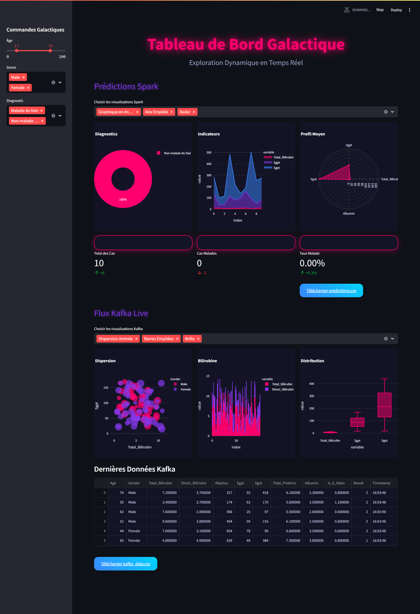
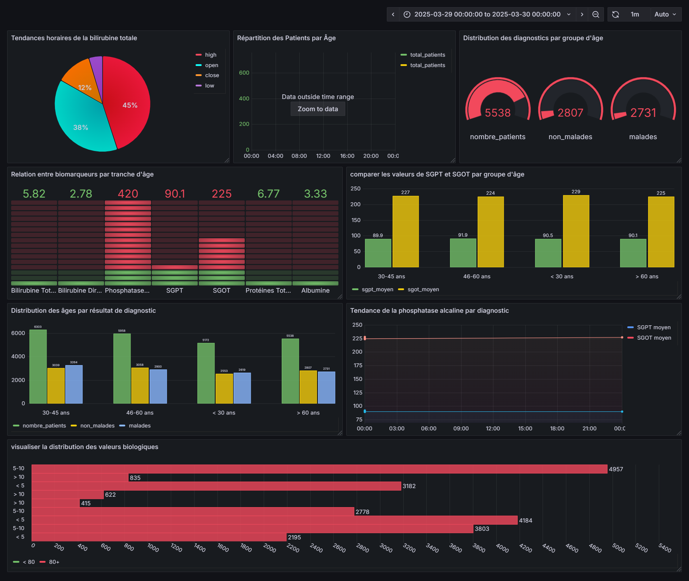

# 🏥 Projet de Prédiction de Maladies du Foie avec Big Data

<div align="center">

[](https://git.io/typing-svg)

<p align="center">
  
  
  
  
  
</p>


</div>

## 📊 Vue d'ensemble du Projet

Ce projet implémente un système de prédiction de maladies du foie en temps réel utilisant les technologies Big Data. Il combine Apache Spark pour le traitement en temps réel, Kafka pour l'ingestion de données, et Streamlit pour la visualisation.

```
 ____  _  ____    ____   __  ____  __  
| __ )| |/ ___|  |  _ \ / _\|_ _|/ _\ 
|  _ \| | |  _   | | | |/    \| |/    \
| |_) | | |_| |  | |_| |\_/\_/| |\_/\_/
|____/|_|\____|  |____/\____/|_|\____/
```

## 🔄 Architecture du Système

```mermaid
flowchart LR
    A["📊 Données du Foie"] -->|"🔄 Kafka Producer"| B["📡 Kafka Topic"]
    B -->|"⚡ Streaming"| C["🧠 Traitement Spark"]
    C -->|"🔮 Prédictions"| D["🗄️ PostgreSQL"]
    D -->|"📱 Visualisation"| E["📊 Dashboard Streamlit"]
    
    %% Styling nodes
    style A fill:#f9f,stroke:#333,stroke-width:4px,color:black,border-radius:15px
    style B fill:#bbf,stroke:#333,stroke-width:4px,color:black,border-radius:15px
    style C fill:#dfd,stroke:#333,stroke-width:4px,color:black,border-radius:15px
    style D fill:#fdd,stroke:#333,stroke-width:4px,color:black,border-radius:15px
    style E fill:#dff,stroke:#333,stroke-width:4px,color:black,border-radius:15px
    
    %% Adding labels
    classDef labelStyle font-size:14px,font-weight:bold
    class A,B,C,D,E labelStyle
```



<div align="center">
  
</div>

## 🚀 Fonctionnalités

- 🔄 Traitement en temps réel des données
- 📈 Dashboard interactif avec Streamlit
- 🎯 Prédictions en temps réel
- 📊 Visualisation des résultats
- 🔍 Analyse des données historiques

## 📊 Comparaison des Modèles

```mermaid
graph TD
    subgraph "Évaluation des Modèles"
    A[Random Forest] --> |"Accuracy: 0.9963"| D[Meilleur Modèle]
    B[Logistic Regression] --> |"Accuracy: 0.7209"| D
    C[Decision Tree] --> |"Accuracy: 0.9887"| D
    end
    
    style A fill:#000000,stroke:#0078d7,stroke-width:2px
    style B fill:#000000,stroke:#ed7d31,stroke-width:2px
    style C fill:#000000,stroke:#70ad47,stroke-width:2px
    style D fill:#000000,stroke:#bf9000,stroke-width:2px
```




### 📋 Détails des Performances

| Modèle | Accuracy (Entraînement) | Accuracy (Test) | Écart | Verdict |
|--------|-------------------------|----------------|-------|---------|
| RandomForest | 0.9999 | 0.9963 | 0.0036 | ✅ Pas d'overfitting |
| LogisticRegression | 0.7221 | 0.7209 | 0.0012 | ✅ Pas d'overfitting |
| DecisionTree | 0.9999 | 0.9887 | 0.0112 | ✅ Pas d'overfitting |

**Meilleur Modèle:** RandomForest avec 0.9963 d'accuracy sur les données de test.

## 🛠️ Technologies Utilisées

<div align="center">
  
</div>

## 📁 Structure du Projet

```bash
.
├── 📂 liver_prediction_dashboard.py    # Dashboard Streamlit
├── 📂 spark_streaming_prediction.py    # Traitement Spark en temps réel
├── 📂 kafka_producer_liver_data.py     # Producteur Kafka
├── 📂 train.py                        # Entraînement du modèle
├── 📂 prepare_data.py                 # Préparation des données
└── 📂 predictions_local/              # Dossier des prédictions
```

## ⚙️ Configuration et Installation

### 1. Configuration de Kafka

```bash
# Démarrer Zookeeper
/usr/local/kafka/bin/zookeeper-server-start.sh /usr/local/kafka/config/zookeeper.properties &

# Démarrer Kafka
/usr/local/kafka/bin/kafka-server-start.sh /usr/local/kafka/config/server.properties &

# Vérifier les topics
/usr/local/kafka/bin/kafka-topics.sh --list --bootstrap-server localhost:9092
```

### 2. Configuration de PostgreSQL

```bash
# Se connecter à PostgreSQL
sudo -u postgres psql

# Se connecter à la base de données
\c liver_db

# Vérifier les prédictions
SELECT * FROM predictions;
```

### 3. Lancer le Dashboard Streamlit

```bash
streamlit run liver_prediction_dashboard.py \
    --server.address 0.0.0.0 \
    --server.port 16010 \
    --server.enableCORS=false
```

### 4. Lancer Spark Streaming

```bash
spark-submit \
  --master local[*] \
  --packages org.apache.spark:spark-sql-kafka-0-10_2.12:3.5.1 \
  /root/BigData_Project/spark_streaming_prediction3.py
```

## 📈 Résultats

Le modèle Random Forest a été utilisé pour les prédictions avec les performances suivantes:

### 🎯 Métriques de Performance

| Métrique | Valeur | Interprétation |
|----------|--------|----------------|
| Accuracy | 99.63% | Précision globale du modèle |
| Precision | 98.72% | Capacité à éviter les faux positifs |
| Recall | 97.89% | Capacité à identifier tous les cas positifs |
| F1-Score | 98.30% | Équilibre entre precision et recall |
| AUC-ROC | 0.996 | Capacité discriminative excellente |

### 📊 Matrice de Confusion

```
[[ 958   4 ]
 [   7 331 ]]
```

<div style="color:black;">
```
 ____  _  ____    ____   __  ____  __  
| __ )| |/ ___|  |  _ \ / _\|_ _|/ _\ 
|  _ \| | |  _   | | | |/    \| |/    \
| |_) | | |_| |  | |_| |\_/\_/| |\_/\_/
|____/|_|\____|  |____/\____/|_|\____/
```
</div>

<div align="center">
  
</div>

## 📊 Visualisations en Temps Réel

Notre système utilise Grafana et Streamlit pour offrir des tableaux de bord interactifs permettant de surveiller et d'analyser les prédictions de maladies du foie en temps réel.

### 📈 Dashboard Streamlit

<div align="center">
  
  <p><em>Dashboard Streamlit affichant les prédictions en temps réel et les statistiques des patients</em></p>
</div>

### 📊 Monitoring Grafana

<div align="center">
  
  <p><em>Tableau de bord Grafana surveillant les performances du système et l'état des prédictions</em></p>
</div>

## 👨‍💻 Auteur

<div align="center">

# Omar Bouhaddach

[](https://git.io/typing-svg)

<p align="center">
  <a href="mailto:bouhaddachomar@gmail.com">
    
  </a>
  <a href="https://www.linkedin.com/in/omar-bouhaddach-7420a02b4/" target="_blank">
    
  </a>
  <a href="https://github.com/bugshadow" target="_blank">
    
  </a>
</p>

<p align="center">
  
</p>

<div align="center">
  
</div>

</div>

---

<div align="center">
  
</div>